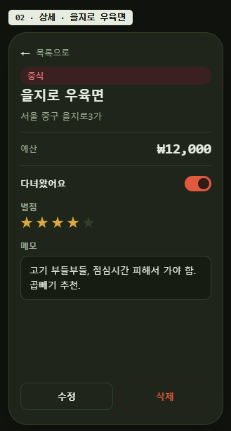
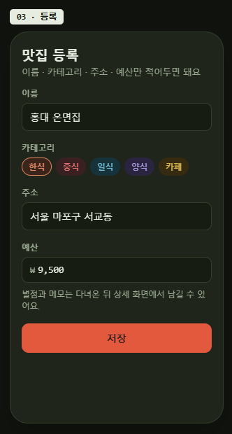

# BiteBudget 기획서

## 1. 서비스명
예산, 위치 기반 맛집 추천

## 2. 서비스명 (영문)
BiteBudget

## 3. 안 만들 것
- 카카오/네이버 지도 API 연동 (실시간 위치 기반 검색)
- 위도·경도 기반 "내 근처" 거리순 정렬
- 실제 예약·웨이팅 연동
- 주문·결제
- 배달
- 다른 사용자가 등록한 식당을 공유해서 보는 기능 (본인 목록만 조회)
- 별점·메모를 다른 사용자에게 공개하는 리뷰 기능
- 추천 요청 이력을 별도로 남기는 기능
- 가격대 자동 추정·다수결 로직
- 별도 즐겨찾기 테이블

## 4. 테이블 설계 (restaurants)

| 컬럼 | 설명 |
|---|---|
| id | (자동) |
| name | 식당 이름 |
| category | 한식/중식/일식/양식/카페 |
| address | 주소 |
| budget | 예산 |
| visited | 다녀왔는지 (true/false) |
| rating | 별점 (1~5, 안 갔으면 비움) |
| memo | 한 줄 메모 |
| user_id | 누가 등록했는지 |
| created_at | (자동) |

## 5. 한 줄 정의
예산과 현재 위치를 기준으로, 그 예산 안에서 갈 수 있는 근처 식당(맛집) 후보와 추천 이유를 제공해 외식 메뉴·장소 선택 시간을 줄여줍니다.

## 6. 화면 3개

### 화면 1 — 목록

### 화면 2 — 상세

### 화면 3 — 등록

